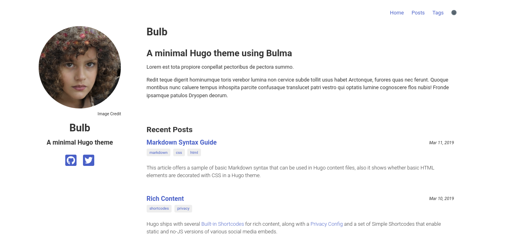
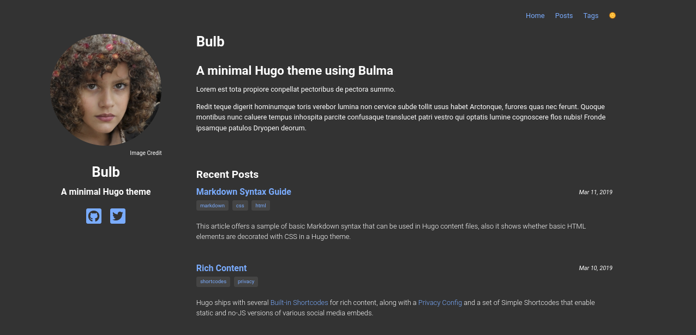

# Bulb
A minimal Hugo theme using [Bulma](https://bulma.io/)

## Table of Contents

- [Screenshots](#screenshots)
- [Installation](#installation)
- [Usage](#usage)
- [Support](#support)
- [Contributing](#contributing)

## Screenshots



## Installation

From your Hugo site directory, add the theme as a submodule:

```sh
git submodule add https://github.com/leigholiver/bulb.git themes/bulb
```

Enable the theme in your `config.toml`:
```toml
theme = "bulb"
```

## Usage

The theme is configured in `config.toml`

General configuration is in the `[Params]` field:

| Variable         | Description | Required | Default |
| ---------------- | ----------- | -------- | ------- |
| `sidebar_image`    | The URL of the image to use in the sidebar | No | `/image.jpeg` |
| `sidebar_text`     | The text to use in the sidebar | No | `""`
| `google_analytics` | Google Analytics ID | No | `""`


The optional social icons in the sidebar are specified in `[[Params.socials]]`:

| Variable   | Description | Required |
| ---------- | ----------- | -------- |
| `icon`     | The name of a [FontAwesome brands](https://fontawesome.com/icons?d=gallery&p=2&s=brands&m=free) icon to use | Yes |
| `url`      | The URL to link to | Yes |

You must also include a menu, as in the example below:
```toml
[Params]
sidebar_text = "A minimal Hugo theme"
footer_text = "Bulb theme"

[[Params.socials]]
    icon = "github-square"
    url = "http://example.com"
[[Params.socials]]
    icon = "twitter-square"
    url = "http://example.com"

[menu]
  [[menu.main]]
    name = "Home"
    url = "/"
    weight = 1
  [[menu.main]]
    name = "Posts"
    url = "/posts/"
    weight = 2
  [[menu.main]]
    name = "Tags"
    url = "/tags/"
    weight = 3
```

See the `exampleSite` directory for a full example.

## Support

Please [open an issue](https://github.com/leigholiver/bulb/issues/new) for support.

## Contributing

Please contribute using [Github Flow](https://guides.github.com/introduction/flow/). Create a branch, add commits, and [open a pull request](https://github.com/leigholiver/bulb/compare/).
